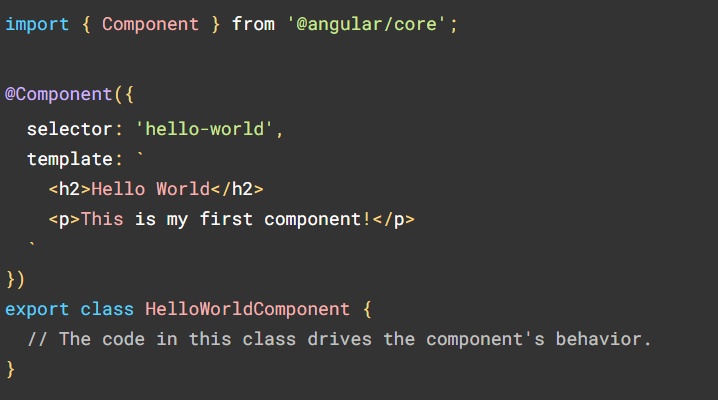
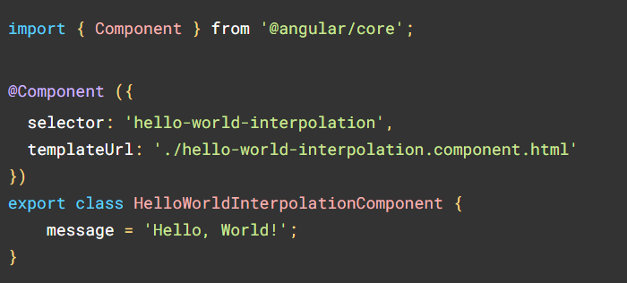
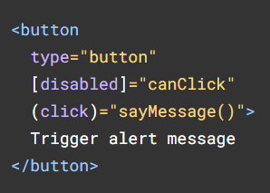
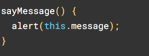
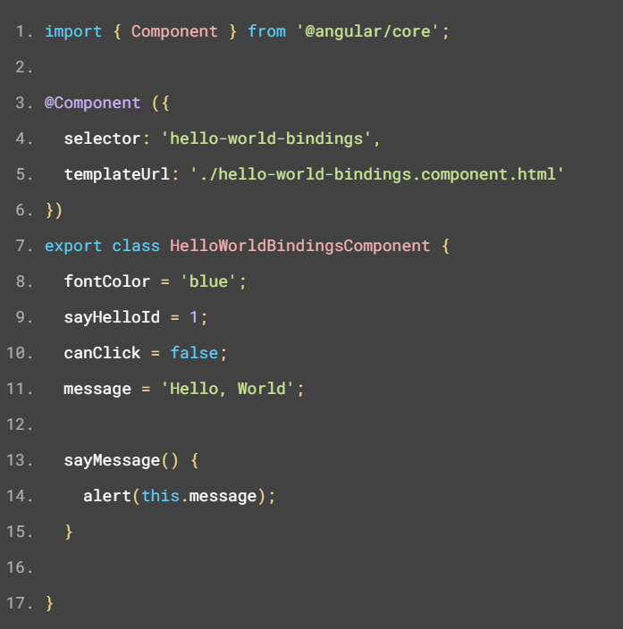
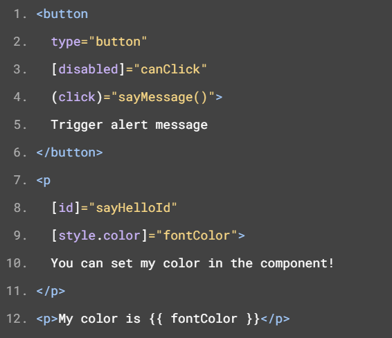
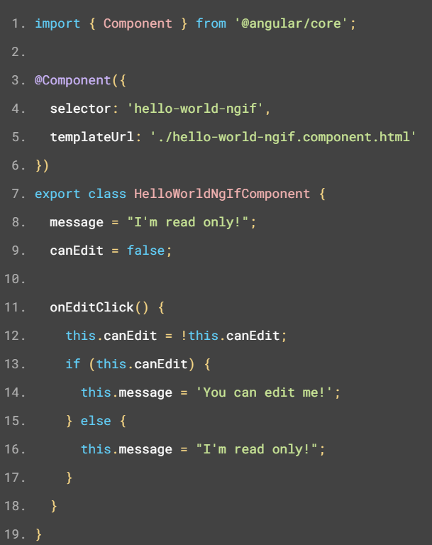
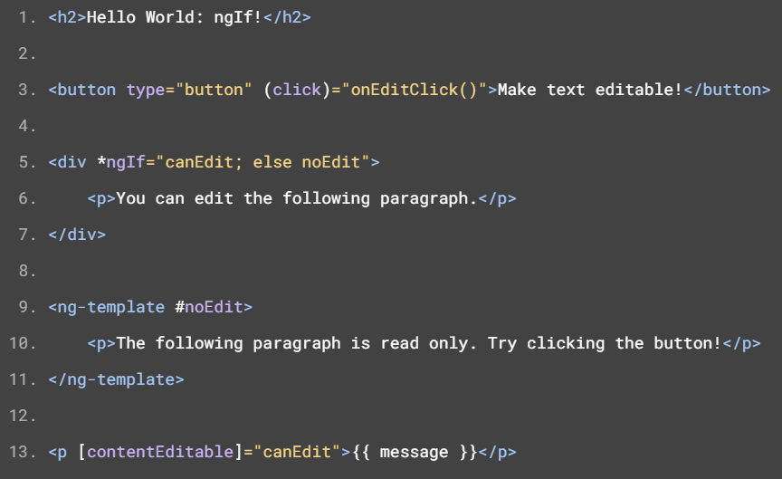
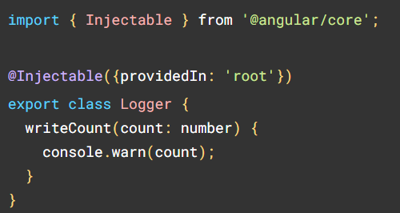

# basic-angular-form

## What is angular?

Angular is a development platform, built on TypeScript. As a platform, Angular includes:

A component-based framework for building scalable web applications
A collection of well-integrated libraries that cover a wide variety of features, including routing, forms management, client-server communication, and more
A suite of developer tools to help you develop, build, test, and update your code

## Angular: the essentials

### 1) Components

Components are the building blocks that compose an application. A component includes a TypeScript class with a @Component() decorator, an HTML template, and styles. The @Component() decorator specifies the following Angular-specific information:

 - A CSS selector that defines how the component is used in a template. HTML elements in your template that match this selector become instances of the component.

 - An HTML template that instructs Angular how to render the component

 - An optional set of CSS styles that define the appearance of the template's HTML elements

The following is a minimal Angular component:
import { Component } from '@angular/core';

To use this component, you write the following in a template:

When Angular renders this component, the resulting DOM looks like this:

Angular's component model offers strong encapsulation and an intuitive application structure. Components also make your application painless to unit test and can improve the overall readability of your code.

### 2) Templates
Every component has an HTML template that declares how that component renders. You define this template either inline or by file path.

Angular extends HTML with additional syntax that lets you insert dynamic values from your component. Angular automatically updates the rendered DOM when your component's state changes. One application of this feature is inserting dynamic text, as shown in the following example.

The value for message comes from the component class:

When the application loads the component and its template, the user sees the following:

Notice the use of double curly braces—they instruct Angular to interpolate the contents within them.

Angular also supports property bindings, to help you set values for properties and attributes of HTML elements and pass values to your application's presentation logic.

Notice the use of the square brackets—that syntax indicates that you're binding the property or attribute to a value in the component class.

Declare event listeners to listen for and respond to user actions such as keystrokes, mouse movements, clicks, and touches. You declare an event listener by specifying the event name in parentheses:

The preceding example calls a method, which is defined in the component class:

The following is a combined example of Interpolation, Property Binding and Event Binding within an Angular template:

Component typescript example:

component html example:

Add additional functionality to your templates through the use of directives. The most popular directives in Angular are *ngIf and *ngFor. Use directives to perform a variety of tasks, such as dynamically modifying the DOM structure. And create your own custom directives to create great user experiences.

The following code is an example of the *ngIf directive.

*ngIF component example typescript example

*ngIF component example html example

Angular's declarative templates let you cleanly separate your application's logic from its presentation. Templates are based on standard HTML, for ease in building, maintaining, and updating.

### 3) Dependency Injection

Dependency injection lets you declare the dependencies of your TypeScript classes without taking care of their instantiation. Instead, Angular handles the instantiation for you. This design pattern lets you write more testable and flexible code. Even though understanding dependency injection is not critical to start using Angular, we strongly recommend it as a best practice and many aspects of Angular take advantage of it to some degree.

To illustrate how dependency injection works, consider the following example. The first file, logger.service.ts, defines a Logger class. This class contains a writeCount function that logs a number to the console.

Next, the hello-world-di.component.ts file defines an Angular component. This component contains a button that uses the writeCount function of the Logger class. To access that function, the Logger service is injected into the HelloWorldDI class by adding private logger: Logger to the constructor.

## Learning Objectives
After this learning challenge, you'll be able to:
- Use the angular cli commands
- Have a basic understanding of typescript
- Generate components and services in angular
- Configure a provided node API
- Make a basic angular form
- Send http requests from an angular app to a node server

## The Mission
You have been part of becode for quite some time, and you've made a lot of friends in the process. Make an Angular application on which your friends can fill in their data so you can have it in your node.js friendlist api.

### Must-have features

All the fields you need to put the data of your friends in your friendlist. These are:
- First name
- Last name
- Email
- Phone number
- Favourite language (html, css, js, php, ...), this will be a select with options

Error reporting, give some visual feedback to the user if they put something wrong in the inputs.

Form validation

A Friend list, do this by sending a GET request to your local node server.

A POST request to add a friend to your friend list.

### Nice-to-have features

- Make sure the email and phone number are actually emails and phone numbers.
- Make it as easy as possible for a user to add a phone number, following phone numbers could all be valid:
    - 0488888888
    - +324888 88888
    - 04 88 88 88 88
    - 0      4 8     8 8888 88
    - It's okay to only take Belgian phone numbers into account.
- Make seperate pages for adding a friend and your friend list.
- Make a "best friend" list by adding a favourite checkbox to the form
    - You can also make a seperate page for your best friends
    - You'll have to make a new app.GET function in your node server
- Add extra fields, whatever you like. Examples:
    - Profile picture
    - Signature move
    - Favourite meme
    - ...
- Think of your own new app.GET function, the possibilities are endless. Examples:
    - A list of all the people that like php
    - An amount of random friends from your list
    - A list of all the people between the age of 30 and 40
    - ...

### Steps
1. [x] Clone this repository locally
2. [x] Check if you have node.js and npm, if not, install them.
    - node: <code>node -v</code> or <code>node -version</code>
    - npm: <code>npm -v</code> or <code>npm -version</code>
3. [x] Install the Angular cli with <code>npm install -g @angular/cli</code> and check afterwards if you have it with <code>ng version</code>
4. [x] Navigate to the root of your clone of this repository in the terminal and enter the command <code>ng new project-name</code>. You should now have 2 folders called "server", your node API, and "project-name", your angular app.
5. [x] Go inside of the "project-name" folder and run the command <code>ng serve --port 4500</code>. You can now check out your angular app on <code>localhost:4500</code>.
6. [x] In your editor, navigate to <code>project-name/src/app</code>. In here you'll find 2 things.
    - The template, app.component.html
    - The component, app.component.ts.
    - The view you see in the page is produced by the combination of that <strong>template</strong> and the <strong>component</strong> that brings the logic to the template.
    - You should never pay attention to .spec files, these are for unit testing which is out of scope for this exercise.
7. [x] Empty the "AppComponent" class and the template. The template file should be completely empty. Inside of the AppComponent class you'll write your logic and in the template you can use it and write the html.
8. [x] In the HTML file, add a form with the required inputs at least. Go take a look at the must haves to see which are required. Don't forget a submit button, make it a regular button, <strong>not an input type button</strong>!
9. [x] You might have already added a select input for the languages with the options inside of it. This can be optimised by putting the names of the languages inside of an array in your component class. Next, you can use the ngFor loop to generate all the options, way more efficient right?
10. [x] Now you will have to bind the data to your form
    - In your app.module.ts, import the FormsModule from @angular/forms. Also add it to the imports array.
    - Add <code>#formName="ngForm"</code> to your form. This will make "formName" a variable which contains all the data of the form in realtime.
    - Also add <code>#inputName="ngModel"</code> to every input tag.
    - Make sure all your inputs have a name attribute and also put <code>ngModel</code> inside of each input.
    - Test if it works by adding <code>{{ formName.value | json }}</code> at the top of your html. If you take a look at your page and fill in some values, you'll see them update automatically.
11. [x] The ngModel that's added to the inputs is not complete yet. It's supposed to be used to bind the data to a model.
    - First we need to add a new "friend" model to our project, in the root of your angular app in the terminal, run the command <code>ng generate class Friend</code>.
    - Open the generated friend.ts file and add a constructor to the class. In there, depending on which inputs you used, add the corresponding properties. Don't forget to typehint them. Thanks typescript!
    - In your component class, instantiate the friendModel through the friend class with all the properties set to null. To do this you'll also need to import the Friend class.
    - Next, in your HTML, change the ngModel of your inputs to be like this: <code>[(ngModel)]="friendModel.propertyName"</code>. Of course, replace the propertyName with the corresponding name of your property.
    - To test if this works, go back to the top of your HTML and change <code>{{ formName.value | json }}</code> to <code>{{ friendModel | json }}</code>. You'll see that at the top of your page in the browser, nothing really changed. Now your data is binded to the friend model.
12. [x] Now we need to display when a field is invalid to the user.
    - Add the required property to all inputs, this will make sure that angulars "invalid" tag gets added to the fields that are not filled in.
    - Make a class, or use a bootstrap class, that makes it clear that something is wrong with that input. For example, a red border color.
    - To conditionally add that class to your input, add <code>[class.yourClassName]="property.invalid"</code>. This means the class "yourClassName" will be applied to the input when a specific property is invalid.
    - Now the fields that are empty, and thus invalid, will have the invalid class applied. However, we don't want this when the user hasn't even touched the input. To add this functionality, change the condition to <code>[class.yourClassName]="property.invalid && property.touched"</code>.
    - The only way fields are invalid now, is when there's nothing in it and the user has touched the input already. However, if the user would for example put a sentence in the phone number field, we want to display it as invalid too.
    - To do this, add the pattern property to the input field and as a value add the regular expression that it would have to suffice. Go to https://regex101.com/ if you want to test out and learn more about regex.
    - Regex is hard and you don't have to do it perfectly, however it is manageable to
        - Have no numbers in names
        - Have no letters in phone numbers
        - Have no special code characters allowed anywhere if they're not needed.
    - Further error displaying is optional. You could for example add a message below each field. After that you can give it a conditional class, based on if the field is valid / touched or not. The class will make it not display if the field is valid.
13. [x] If all the fields are valid, the forms valid property will also be set to valid. Let's disable the button when the form is not valid.
    - To check if the form is invalid, you'll need to use <code>formName.form.invalid</code>.
    - You can make a conditional property again by entering <code>[property]="condition"</code> in your button. Disable the button conditionally based on the invalidity of the form.
    - Now that the form validation is set up, add the "novalidate" property to your form to prevent the automatic browser validation.
    - To see if your button is actually getting disabled, inspect your button HTML in the browser.
14. [x] Let's submit the data to a server now, but before we can do that we need to be able to do something on submit and get access to http requests.
    - If you add the ngSubmit property to your form, you can bind a function to it and use that function in your component class to trigger it on submit. This is how it looks like: <code>(ngSubmit)="yourFunction()"</code>.
    - In your component class, define the function and console log your friend model. Now when you submit you'll see the data appear in your console.
    - To add this friend to your friendlist server, we'll need to make a service for it. We'll use the cli for this and input the command <code>ng g s addFriend</code>. This means, a"ng"ular "g"enerate "s"ervice with name "addFriendService", when you generate a service you'll see that after the name you've given it will automatically add "Service" after it.
    - In your newly generated addFriend.service.ts file, import the HttpClient. In your addFriend class, add a new private property called http to the constructor. Typehint it to be of type HttpClient.
    - You'll also have to import the HttpClientModule in your app.module.ts, also add it to the imports array below.
15. [x] We now have our data on submit and we're in a position to start http requests. Now we want to post our data to a server.
    - In the service, make a method called addFriend and give it a parameter, typehint it to be of the Friend type. You'll also need to import Friend.
    - In this method, write a post request. It looks like this: <code>this.http.post<any>(url, data)</code>. Return it afterwards, what you'll get back in something called an observable. http is the property HttpClient, <any> is the type of data your post can contain and url is the url you're sending the data to.
    - We'll get back to the url later. For now, make a property called 'url' and leave it as an empty string.
    - In your app.component.ts also import your service and make a constructor in the component class. Add a private "addFriendService" property and typehint it.
    - Now we can use the service in the method that triggers when the form gets submitted. In the method, call the addFriend method of the addFriendService and pass the friend data to it.
    - The method we made returns something called an "observable". If you want, you can also work with promises, however in this case we used an observable and to get the data out of it, we need to subscribe to it.
    - The code to subscribe to an observable looks like this <code>observable.subscribe(data => it worked, error => it didn't work)</code>.
16. [ ] Everything is set up in order to send data to your local api.
    - First, in the server.js file in the server folder, change the port to whatever number you like that is not occupied. Port numbers 9000 - 9099 are always safe, just make sure no other application is running on those ports.
    - In the server folder in your terminal, run the command <code>node server</code>. You won't get any confirmation that the server is running, just a blank new line. Now navigate to <code>localhost:PORT</code>.
    - You should see "Hello from server". That is because the get function in the server file with the root "/" as it's path sent it as a response.
    - You'll find an array allFriends, this is where you'll push your new friend to. But first, let's take a look at your friends in the server.
    - Add a new get function with path "allFriends" and send the allFriends variable as a response. <strong>If you make changes to your server, make sure it's not running and then run it again with the <code>node server</code> command.</strong>If you now navigate to <code>localhost:PORT/allFriends</code> you'll get to see all your friends.
    - Remember the url that we left empty? It's time to configure a path to which we'll post our data. Start by changing the url to <code>'http://localhost:PORT/'</code>.
    - Next, make a new post function with path "addFriend". In here, push the request body to the allFriends array.
    - If you now go to your form and add a friend, submit the form, you'll see in your server, localhost:PORT/allFriends, that the friend has been added to the list.
17. [ ] You've sent data, but now we also want to display the newly updated friend list on your page. To do this, we'll have to make a get request to the server.
    - We want to do this get request in 2 different cases, one is when the page loads and the other is when we post data to the server.
    - First, let's write the function itself and later call the function when we need it. Make a new public async function in the component and pass the url as a parameter. Typehint the parameter and the function. The function will return a Promise of type any. A typehint of a promise with type looks like this: <code>Promise<any></code>.
    - Then, add a fetch to the function and return and await it. The method should be get and the headers should be <code>'Content-Type': 'application/json'</code>.
    - Add a property to your component class called allFriends and in the fetch where you can access the fetched data, assign the value of the data to that property.
    - We now have our fetch working, let's call it when we submit the form first. To do this in the success part of the subscribe, call the function with url 'http://localhost:PORT/allFriends'.
    - To do it on page load, import OnInit. Next your AppComponent class has to implement it.
    - To make something happen on pageload, in the class add <code>ngOnInit(): any { something happens }</code>. In here, call your fetch function like we did previously for the form submit.
    - We now have our friend list updated in the property allFriends of the component class.
    -  To check if you have your friends data console log it.
18. [ ] Now we can display the friends in the template using the property allFriends.
    - To do this we'll use the ngFor loop, add the following code to a div: <code>*ngFor="let friend of allFriends"</code>.
    - In this div, if you enter {{ friend.email }} for example. You'll see that on your page you'll see all the emails of your friends displayed.
    - Now display all details of your friends, try adding new friends in the process. It updates instantly!
19. [ ] You now have all the must-have features. Congratulations! If you have time left, be sure to take a look at the nice-to-have features. Here are some suggestions as well:
    - Try removing people from your friend list based on email. Post the email of a friend, find the friend on the server and pop it out of the array.
    - Try updating the data from a friend based on email. Same thing, post the email and find that friend, update the values.
    - Make seperate pages by generating new components! You'll have to look into routing as well!
    - Get creative!
20. [ ] Congratulations, you survived the first steps of Angular and Node. I'm proud of you!

